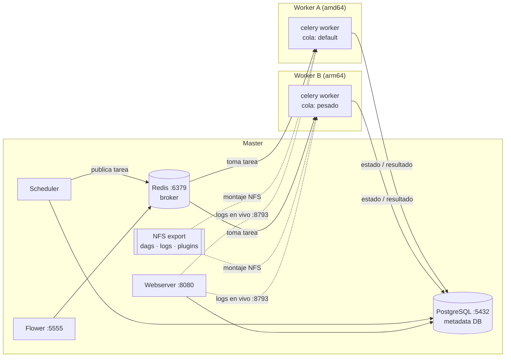

# airflow-celery-cluster

Receta reproducible para desplegar **Apache Airflow 2.9 distribuido con CeleryExecutor**
on-prem con Docker Compose: un servidor **master** y N servidores **worker**, que pueden
ser de arquitecturas mixtas (x86_64 y ARM64). Los DAGs, logs y plugins se comparten por NFS.

El repo contiene solo infraestructura como código y documentación: no incluye datos,
secretos ni DAGs de negocio.

## Arquitectura



| Pieza | Rol |
|---|---|
| **Airflow** | Orquestador: define el orden y el horario de las tareas (DAGs). |
| **Celery** | Motor de ejecución distribuida: reparte las tareas entre los workers. |
| **Redis** | Broker: cola de mensajes donde el Scheduler publica cada tarea lista. |
| **PostgreSQL** | Metadata DB: estado y resultado de cada tarea. |
| **NFS** | La misma copia física de DAGs, logs y plugins en todos los servidores. |
| **Flower** | Dashboard en vivo de los workers conectados y del estado de las colas. |

Detalle conceptual en [docs/arquitectura.md](docs/arquitectura.md).

## Estructura

```
airflow-celery-cluster/
├── master/
│   ├── Dockerfile              # imagen única (master y workers), multi-arquitectura
│   ├── cluster_hostname.py     # el worker se anuncia con su IP (WORKER_IP)
│   ├── requirements.txt        # librerías Python, todas con versión fija
│   ├── docker-compose.yml      # postgres, redis, init, webserver, scheduler, flower
│   └── .env.example
├── worker/
│   ├── docker-compose.yml      # celery worker que se conecta al master
│   └── .env.example
├── dags/
│   └── test_worker_rapido.py   # DAG de humo para validar workers y NFS
├── docs/
│   ├── arquitectura.md
│   ├── nfs.md                  # instalación y configuración del NFS
│   ├── redis.md                # configuración y endurecimiento de Redis
│   ├── flower.md               # acceso, autenticación y uso de Flower
│   ├── revision-inicial.md     # auditoría del estado inicial y qué se corrigió
│   └── adr/                    # decisiones de arquitectura (ADR)
└── CHANGELOG.md
```

## Requisitos

- Linux con Docker Engine 24+ y Docker Compose v2 en cada servidor. Probado en CentOS.
- Conectividad del master hacia los workers y de los workers hacia el master
  (ver [Puertos](#puertos-y-firewall)).
- Un **UID común** en todos los servidores, dueño de `AIRFLOW_DATA_DIR`.
- NFS configurado según [docs/nfs.md](docs/nfs.md).

## Variables ajustables

Todas se definen en el `.env` de cada carpeta, que se crea copiando `.env.example`.
Ninguna requiere editar el `docker-compose.yml`.

### Concurrencia: cuántas tareas corren a la vez

En cada momento, el número real de tareas en ejecución es el **mínimo** de estos límites:

```
min( AIRFLOW_PARALLELISM ,  Σ WORKER_CONCURRENCY de los workers ,  slots del pool ,  AIRFLOW_MAX_ACTIVE_TASKS_PER_DAG por DAG )
```

| # | Variable `.env` | Archivo | Se mapea a | Default | Explicación |
|---|---|---|---|---|---|
| 1 | `AIRFLOW_PARALLELISM` | `master/.env` | `AIRFLOW__CORE__PARALLELISM` | `32` | Máximo de tareas ejecutándose al mismo tiempo en **todo el cluster**, por cada scheduler. Es un techo global: si vale 4, nunca corren más de 4 tareas aunque haya 3 workers con 16 slots cada uno. Regla práctica: debe ser **≥ la suma de `WORKER_CONCURRENCY`** de todos los workers. Ejemplo: dos workers de 16 y uno de 2 suman 34, así que conviene un valor de 34 o más. Bajarlo sirve para proteger fuentes de datos que no aguantan mucha carga. |
| 2 | `AIRFLOW_MAX_ACTIVE_TASKS_PER_DAG` | `master/.env` | `AIRFLOW__CORE__MAX_ACTIVE_TASKS_PER_DAG` | `16` | Máximo de tareas simultáneas de **un mismo DAG**, sumando todas sus corridas. Evita que un DAG con muchas tareas paralelas acapare el cluster. Un DAG puede sobrescribirlo con `max_active_tasks=`. |
| 3 | `AIRFLOW_MAX_ACTIVE_RUNS_PER_DAG` | `master/.env` | `AIRFLOW__CORE__MAX_ACTIVE_RUNS_PER_DAG` | `16` | Máximo de corridas (DAG runs) simultáneas de un DAG. Con `1`, una corrida nueva espera a que termine la anterior: útil para cargas incrementales que no deben solaparse. Un DAG puede sobrescribirlo con `max_active_runs=`. |
| 4 | `WORKER_CONCURRENCY` | `worker/.env` | `celery worker --concurrency` | `16` | Tareas simultáneas en **ese** worker, uno por servidor. Ajústalo según los núcleos y la RAM. Para tareas pesadas (pandas, geoespacial) usa valores bajos, por ejemplo `2`. |
| 5 | `WORKER_QUEUES` | `worker/.env` | `celery worker --queues` | `default` | Colas que atiende el worker, separadas por coma. Una tarea va a una cola con `queue="pesado"` en el operador; si no se indica, va a `default`. Así se dirigen las tareas pesadas a un servidor con más recursos. |
| 6 | Pool `default_pool` | UI → Admin → Pools | — | `128` slots | Otro límite global, por pool. Si `AIRFLOW_PARALLELISM` sube por encima de 128, también hay que subir este valor. |

### Rendimiento del scheduler y la UI

| Variable `.env` | Archivo | Default | Explicación |
|---|---|---|---|
| `AIRFLOW_MIN_FILE_PROCESS_INTERVAL` | `master/.env` | `30` | Cada cuántos segundos se vuelve a leer cada archivo de DAG. Con NFS y muchos DAGs, un valor más alto reduce CPU e I/O, pero los cambios en los DAGs tardan más en verse. |
| `AIRFLOW_WEBSERVER_WORKERS` | `master/.env` | `2` | Procesos gunicorn de la UI. Cada uno consume unos 300–500 MB de RAM. |
| Límites `deploy.resources` | `master/docker-compose.yml` | ver archivo | CPU y RAM máximas por servicio (postgres 1 CPU/1G, webserver 2/2G, scheduler 3/3G). Se editan directamente en el compose. |

### Entorno

| Variable `.env` | Archivo | Explicación |
|---|---|---|
| `AIRFLOW_UID` | master y worker | UID con el que corren los contenedores. Debe ser **el mismo en todos los servidores** y ser dueño de `AIRFLOW_DATA_DIR`; si no, aparecen errores de permisos en logs y DAGs sobre NFS. |
| `AIRFLOW_DATA_DIR` | master y worker | Carpeta base en el host. Debe tener la misma ruta en todos los servidores. |
| `AIRFLOW_BASE_URL` | master | URL pública de la UI. Se usa en los enlaces de los correos de alerta. |
| `MASTER_IP` | master y worker | IP del master. En el master, los puertos 8080, 5555, 6379 y 5432 se publican **solo** en esa IP. En el worker, es la dirección de Redis y PostgreSQL. |
| `WORKER_IPS` | master | IPs de todos los workers, separadas por coma. Las usan los comandos de firewall y NFS de `docs/`. |
| `WORKER_NAME` | worker | Nombre **único** del worker: hostname del contenedor y `celery@WORKER_NAME` en Flower. Ejemplo: `worker-41-default`. |
| `WORKER_IP` | worker | IP de **ese** worker. Airflow la guarda como hostname de cada tarea, y el webserver pide los logs en vivo a `http://WORKER_IP:8793`, sin DNS. |
| `AIRFLOW_VERSION` / `PYTHON_VERSION` | master y worker | Versión de la imagen base y del archivo de constraints. Deben coincidir en todo el cluster. |
| `AIRFLOW_IMAGE_NAME` | master y worker | Nombre y tag de la imagen construida. |
| `*_PORT` | master y worker | Puertos publicados (webserver, flower, redis, postgres, log server del worker). |
| `AIRFLOW_SMTP_*` | master y worker | Servidor de correo para alertas. Va también en el worker porque el correo `email_on_failure` lo envía el worker que ejecutó la tarea. |
| `FLOWER_BASIC_AUTH` | master | `usuario:clave` para la UI de Flower. Vacío = sin login (no recomendado). |

### Secretos (obligatorios: compose falla si faltan)

| Variable | Dónde | Cómo generarla |
|---|---|---|
| `AIRFLOW_FERNET_KEY` | **igual** en master y workers | `python3 -c "from cryptography.fernet import Fernet; print(Fernet.generate_key().decode())"` |
| `AIRFLOW_SECRET_KEY` | **igual** en master y workers | `python3 -c "import secrets; print(secrets.token_hex(32))"` |
| `POSTGRES_USER` / `POSTGRES_PASSWORD` | **iguales** en master y workers | — |
| `AIRFLOW_ADMIN_USER` / `AIRFLOW_ADMIN_PASSWORD` | master | Usuario inicial de la UI. |

## Puesta en marcha

### 1. Master

```bash
git clone <este-repo> && cd airflow-celery-cluster/master
cp .env.example .env            # MASTER_IP, WORKER_IPS, "changeme" y claves
set -a; source .env; set +a
sudo mkdir -p "${AIRFLOW_DATA_DIR}"/{dags,logs,plugins,postgres,postgres_backup,ssh}
sudo chown -R "${AIRFLOW_UID}:0" "${AIRFLOW_DATA_DIR}"
docker compose build
docker compose up -d
docker compose ps                # airflow-init debe quedar "exited (0)"
```

Después, configura el export NFS y copia el DAG de prueba:

```bash
cp ../dags/test_worker_rapido.py "${AIRFLOW_DATA_DIR}/dags/"
```

- UI: `http://<MASTER_IP>:8080`
- Flower: `http://<MASTER_IP>:5555`

Si `airflow-init` termina con error, el webserver, el scheduler y Flower **no arrancan**
a propósito. Revisa la causa con `docker compose logs airflow-init`.

### 2. Unir un worker nuevo

```bash
# en el servidor worker, con el NFS ya montado (docs/nfs.md)
git clone <este-repo> && cd airflow-celery-cluster/worker
cp .env.example .env            # MASTER_IP, WORKER_IP, WORKER_NAME, mismas claves y credenciales que el master
```

Elige cómo obtener la imagen según la arquitectura del worker:

| Worker | Cómo obtener la imagen |
|---|---|
| **Misma arquitectura que el master** (p. ej. amd64) | Opción A: construirla ahí con `docker compose build`. Opción B: copiarla desde el master: `docker save <imagen> \| gzip > img.tar.gz` en el master, y `docker load < img.tar.gz` en el worker. |
| **Arquitectura distinta** (p. ej. arm64) | **Siempre** `docker compose build` en el propio worker. Una imagen amd64 exportada con `docker save` no corre en ARM. El Dockerfile usa una imagen base multi-arquitectura, así que se construye nativa sin cambios. |

Verifica la arquitectura con `uname -m` (`x86_64` o `aarch64`).

```bash
docker compose up -d
docker compose ps                # airflow-worker debe quedar "healthy"
```

En pocos segundos, el worker debe aparecer en Flower.

Para un worker dedicado a tareas pesadas, usa en su `.env`
`WORKER_QUEUES=pesado` y `WORKER_CONCURRENCY=2`.

### 3. Probar con el DAG de humo

1. En la UI, activa `test_worker_rapido` y ejecútalo con **Trigger DAG**.
2. En el log de la tarea, la primera línea es el **hostname del servidor worker** que la ejecutó. En la pestaña *Details* de la tarea, el campo *Hostname* muestra su `WORKER_IP`.
3. Revisa el archivo desde cualquier servidor:
   `cat /app/dockerdata/airflow/dags/ultimo_run.txt`.
   Si muestra la hora de la corrida en todos, el NFS funciona.
4. Para probar otra cola, cambia `queue="default"` por `queue="pesado"` en el DAG.

## Puertos y firewall

| Puerto | Servidor | Origen permitido | Uso |
|---|---|---|---|
| 8080 | master | usuarios | UI de Airflow |
| 5555 | master | administradores | Flower |
| 6379 | master | **solo workers** | Redis (broker) |
| 5432 | master | **solo workers** | PostgreSQL |
| 2049 (+111, 20048) | master | **solo workers** | NFS |
| 8793 | cada worker | **solo master** | Logs en vivo de tareas en ejecución |

Redis no tiene contraseña por defecto, así que **restringe el 6379 a las IPs de los workers**.
Ver [docs/redis.md](docs/redis.md).

Las IPs se toman del `.env`, así que no hay que escribirlas a mano en los comandos.

**En el master** (`master/.env`, `WORKER_IPS`):

```bash
cd airflow-celery-cluster/master
set -a; source .env; set +a
for ip in ${WORKER_IPS//,/ }; do
  for port in ${REDIS_PORT} ${POSTGRES_PORT}; do
    sudo firewall-cmd --permanent --add-rich-rule="rule family=ipv4 source address=$ip port port=$port protocol=tcp accept"
  done
done
sudo firewall-cmd --permanent --add-port=${AIRFLOW_WEBSERVER_PORT}/tcp
sudo firewall-cmd --reload
```

Las reglas de NFS están en [docs/nfs.md](docs/nfs.md) y las de Flower, en [docs/flower.md](docs/flower.md).

**En cada worker** (`worker/.env`, `MASTER_IP`):

```bash
cd airflow-celery-cluster/worker
set -a; source .env; set +a
sudo firewall-cmd --permanent --add-rich-rule="rule family=ipv4 source address=${MASTER_IP} port port=${WORKER_LOG_SERVER_PORT} protocol=tcp accept"
sudo firewall-cmd --reload
```

## Documentación

- [docs/nfs.md](docs/nfs.md): servidor y clientes NFS.
- [docs/redis.md](docs/redis.md): broker, persistencia y endurecimiento.
- [docs/flower.md](docs/flower.md): monitoreo y autenticación.
- [docs/revision-inicial.md](docs/revision-inicial.md): estado del que partió el proyecto y qué se corrigió.
- [docs/adr/](docs/adr/): por qué se tomó cada decisión.
- [CHANGELOG.md](CHANGELOG.md): historial de versiones.
